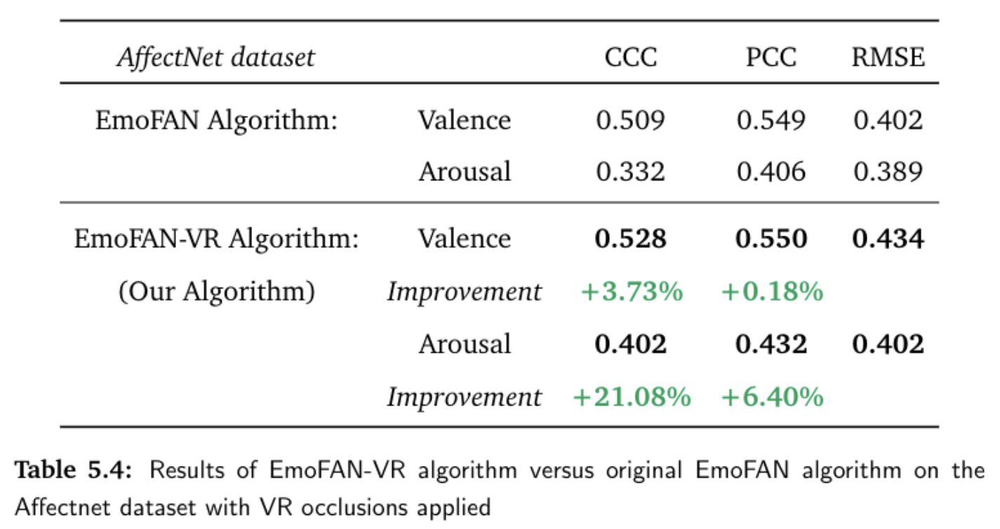
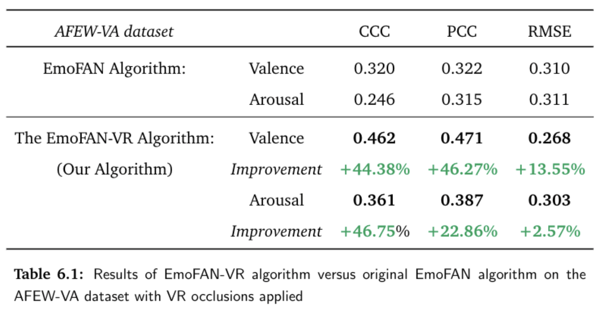

[Link to published paper associated with this code.](https://ieeexplore.ieee.org/document/9750297)

<!-- TABLE OF CONTENTS -->
<details open="open">
  <summary>Table of Contents</summary>
  <ol>
    <li>
      <a href="#about-the-project">About The Project</a>
    </li>
    <li>
      <a href="#project-results">Project Results</a>
    </li>
    <li>
      <a href="#getting-started">Getting Started</a>
      <ul>
        <li><a href="#prerequisites">Prerequisites</a></li>
        <li><a href="#Data-and-Models">Data and Models</a></li>
        <li><a href="#Running-the-Scripts">Running the Scripts</a></li>
      </ul>
    </li>
    <li><a href="#references">References</a></li>
  </ol>
</details>


<!-- ABOUT THE PROJECT -->
## About The Project

This project covers emotion recognition from facial visual signals while the participant wears a virtual reality headset. We use a valence and arousal scale, a multi-dimensional emotion representation. The main contributions of this project are:

* We propose the novel EmoFAN-VR algorithm for emotion detection, trained to solve the partial face problem 
* We design and record EmoVR, a novel dataset of participants displaying spontaneous emotion expressions in response to videos watched in a virtual reality environment


This video shows the valence and arousal predictions of the EmoFAN-VR algorithm on a participant wearing a virtual reality headset.


https://user-images.githubusercontent.com/64492814/132563921-7b3e3c1b-c5fd-4fef-906f-3e08d4372d7d.mov


<!-- PROJECT RESULTS -->
## Project Results

We further trained the EmoFAN algorithm [[1]](#1) on the AffectNet dataset [[2]](#2), with virtual reality occlusions applied around the eye region. 



We then further tested our algorithm on the AFEW-VA dataset [[3]](#3), with virtual reality occlusions applied around the eye region.



The EmoFAN-VR algorithm outperforms the EmoFAN algorithm, on the AFEW-VA dataset with virtual reality occlusions, by a very large margin on all metrics. This result is a new baseline for the AFEW-VA dataset with VR occlusions applied. What makes this result even more remarkable and exciting is that the EmoFAN-VR algorithm was not fine-tuned on the AFEW-VA dataset. This shows that the **EmoFAN-VR algorithm generalises well to new unseen data**.

<!-- GETTING STARTED -->
## Getting Started

This is an example of how you may give instructions on setting up your project locally.
To get a local copy up and running follow these simple example steps.

### Prerequisites

The code requires the following Python packages

```sh
numpy version==1.19.0
PIL version==7.2.0
json version==2.0.9
imutils version==0.5.4
face_alignment version==1.3.4
torch version==1.7.1
torchvision version==0.8.2
cv2 version==4.5.2
skimage version==0.16.2
matplotlib version==3.2.2
seaborn version==0.10.1
```


### Data and Models

1. There are two models we can run, the original EmoFAN model 'emonet_8.pth' and the new algorithm created in this work 'EmoFAN-VR.pth'

2. **AFEW-VA Dataset:**
      Download all twelve zip files from the [AFEW-VA-database](https://ibug.doc.ic.ac.uk/resources/afew-va-database/). Place all 600 files downloaded from these zip files into the 'data' folder, in a folder named 'AFEW-VA'.

<!--- 3. **AffectNet Dataset:** 
   To download the [AffectNet-database](http://mohammadmahoor.com/affectnet/), use this link and follow the instructions to access the data.  --->


 


<!---5. Clone the repo
   ```sh
   git clone https://github.com/your_username_/Project-Name.git
   ``` this is an example of what to do 

4. Enter your API in `config.js`
   ```JS
   const API_KEY = 'ENTER YOUR API';  
   ```                                  --->


### Running the Scripts

Running the script
   ```sh
   python3 train_and_test.py
   ```


<!-- REFERENCES -->
## References


<a id="1">[1]</a> 
Toisoul, A., Kossaifi, J., Bulat, A. et al. 
Estimation of continuous valence and arousal levels from faces in naturalistic conditions. 
*Nat Mach Intell* 3, 42–50 (2021).

<a id="2">[2]</a> 
Mollahosseini, A. et al. 
AffectNet: A Database for Facial Expression, Valence, and Arousal Computing in the Wild.
*IEEE Transactions on Affective Computing* 10, 18-31 (2019).

<a id="3">[3]</a> 
Kossaifi J, Tzimiropoulos G, Todorovic S, Pantic M. 
AFEW-VA database for valence and arousal estimation in-the-wild. 
*Image and vision computing* 65, 23-36 (2017). 


<!-- MARKDOWN LINKS & IMAGES -->
<!-- https://www.markdownguide.org/basic-syntax/#reference-style-links -->
[contributors-shield]: https://img.shields.io/github/contributors/othneildrew/Best-README-Template.svg?style=for-the-badge
[contributors-url]: https://github.com/othneildrew/Best-README-Template/graphs/contributors
[forks-shield]: https://img.shields.io/github/forks/othneildrew/Best-README-Template.svg?style=for-the-badge
[forks-url]: https://github.com/othneildrew/Best-README-Template/network/members
[stars-shield]: https://img.shields.io/github/stars/othneildrew/Best-README-Template.svg?style=for-the-badge
[stars-url]: https://github.com/othneildrew/Best-README-Template/stargazers
[issues-shield]: https://img.shields.io/github/issues/othneildrew/Best-README-Template.svg?style=for-the-badge
[issues-url]: https://github.com/othneildrew/Best-README-Template/issues
[license-shield]: https://img.shields.io/github/license/othneildrew/Best-README-Template.svg?style=for-the-badge
[license-url]: https://github.com/othneildrew/Best-README-Template/blob/master/LICENSE.txt
[linkedin-shield]: https://img.shields.io/badge/-LinkedIn-black.svg?style=for-the-badge&logo=linkedin&colorB=555
[linkedin-url]: https://linkedin.com/in/othneildrew
[product-screenshot]: images/Image_VR_project.png
[EmoFAN-VR-AffectNet]: images/EmoFAN-VR_AffectNet.png
[AFEW-VA-url]: https://ibug.doc.ic.ac.uk/resources/afew-va-database/
